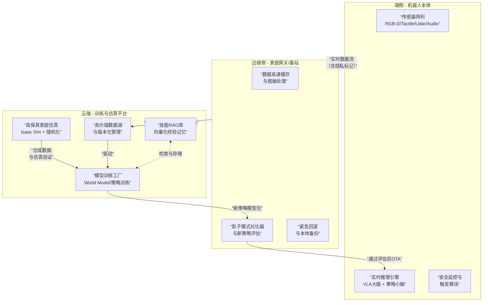

## **轮式家庭通用机器人数据闭环系统设计方案**

### **一、核心设计哲学**

**终极目标**：构建一个以 **“失败与不确定性”为燃料**，以 **“安全与渐进”为约束**的自我进化系统。

**家庭场景三大核心原则**：
1.  **安全第一，失败可控**：任何学习必须以不损害人、宠物、财产为前提。失败是学习信号，但必须发生在仿真或受控环境中。
2.  **隐私优先，数据脱敏**：所有采集数据必须在端侧或近端完成人脸、隐私信息的实时模糊处理。
3.  **任务驱动，价值导向**：闭环围绕“完成家庭任务”展开，而非单纯优化指标。数据价值以**任务成功率、人类偏好、恢复难度**为核心度量。

### **二、总体架构：家庭自适应数据飞轮**

本方案采用 **“云-边-端”协同**的层次化架构，形成高效的进化闭环。

### **三、四大核心模块详解**

#### **1. 数据采集层：智能触发，而非全天录制**
- **核心目标**：采集 **“高信息量”的家庭任务片段（Episode）**。
- **必备传感器**：
  - **视觉**：头部RGB-D（物体识别与操作）、前置广角（导航）、腕部微距摄像头（精细操作）。
  - **力触觉**：腕部六维力扭矩传感器（实现“柔顺操作”，防止捏碎鸡蛋或打滑）。
  - **听觉**：麦克风阵列（接受语音指令，识别异常声响如玻璃破碎）。
  - **轮式本体**：高精度里程计、防跌落、碰撞条（Bumper）。
- **智能触发逻辑**：
  - **被动触发**：碰撞信号、力矩超标、电池骤降、视觉遮挡。
  - **主动触发**：模型预测熵 > 阈值（遇到未知物体）、任务执行超时。
  - **交互触发**：语音指令开始/结束、人类物理干预接管。
- **隐私处理**：在**端侧芯片（如Jetson）**上运行轻量级模型，实时对人脸、屏幕、文件等隐私信息进行像素化模糊，原始高清数据**永不离开机器人**。

#### **2. 数据治理与价值评估层：闭环的“效率心脏”**
- **数据价值向量**：每个Episode计算一个四维评分：
  | 维度 | 权重 | 计算方式 | 家庭场景示例 |
  |---|---|---|---|
  | **失败价值** | 0.4 | 基于任务中断类型与恢复成本 | 倒水洒出 > 抓取失败 |
  | **新颖性** | 0.3 | 当前状态嵌入与历史向量库的余弦距离 | 首次遇到“缠在一起的数据线” |
  | **不确定性** | 0.2 | 多个策略模型预测的动作分歧度 | 面对玻璃茶几，导航策略犹豫不决 |
  | **人类偏好** | 0.1 | 显式（语音评分）与隐式（干预频率）反馈 | 用户说“太吵了”或频繁手动纠正路径 |
- **自动化处理流水线**：
  1.  **过滤**：剔除传感器异常、无任务关联的数据。
  2.  **评分**：计算上述价值向量，仅保留Top 30%的高价值数据上传云端。
  3.  **标注**：利用VLM自动生成场景描述（“机器人试图在沙发下捡球但被卡住”），极大减少人工标注。
  4.  **索引**：将Episode关键帧与描述文本编码，存入**向量数据库（Milvus）**，构建**技能RAG库**，供未来检索相似经验。

#### **3. 模型训练与优化层：大小脑协同进化**
- **大脑（VLA规划器）**：
  - **基座模型**：采用开源**OpenVLA**或微调**Qwen-VL**，注入家庭常识。
  - **输入**：“把冰箱里的牛奶放到餐桌上” + 实时视觉。
  - **输出**：可执行的技能链（`导航至厨房`->`打开冰箱门`->`识别并抓取牛奶`->`导航至餐桌`->`放置`）。
- **小脑（运动控制器）**：
  - **导航**：采用**分层强化学习**，上层规划全局路径，下层实现局部动态避障（避让突然跑过的宠物）。
  - **操作**：采用**Diffusion Policy**，学习人类演示的柔顺、自适应操作轨迹（如擦桌子时根据阻力调整）。
- **家庭世界模型**：
  - 在仿真中学习预测家庭物体的物理交互（推一把带轮子的办公椅 vs. 沉重的实木椅），大幅减少危险的真实试错。

#### **4. 部署与监控层：四级安全闸门**
1.  **仿真压力测试**：新策略在包含大量随机干扰（玩具、临时椅子）的NVIDIA Isaac Sim中运行数千次。
2.  **影子模式运行**：新策略在真机上“并行推理”，但不控制执行器，仅对比其决策与当前稳定版本的差异。
3.  **安全区实机测试**：在划定区域（铺有防撞条的空间）执行新任务，人类监护员随时准备接管。
4.  **渐进式灰度发布**：向1%的机器人舰队推送更新，密切监控**关键指标**：
    - **核心指标**：任务成功率、平均完成时间。
    - **安全指标**：碰撞发生率、人类接管率、紧急停止触发次数。
    - **体验指标**：运动平滑度、噪音水平、用户主动评分。

### **四、关键技术栈选型与您的实践切入点**
结合您的技术背景，以下模块是理想的切入点：

- **数据流水线服务化**：用 **FastAPI** 构建异步数据摄取API，接收机器人回传的Episode数据，并串联起自动标注、价值评分、向量化索引的流水线。
- **技能RAG引擎**：利用 **Milvus/Elasticsearch** 和您熟悉的向量化技术，构建机器人的“经验记忆库”。当机器人遇到新问题时，可快速检索相似的历史解决方案。
- **模型高效服务化**：使用 **vLLM** 部署量化后的“大脑”VLA模型，为ROS 2节点提供高性能、低延迟的推理API。
- **全流程容器化**：使用 **Docker** 封装数据预处理、训练、评估等各个环节，保证实验环境的一致性，并通过Docker Compose或K8s管理整个训练平台。

### **五、分阶段实施路线图**
1.  **阶段一：安全导航闭环（0-6个月）**
    - **目标**：在复杂家庭环境中实现零碰撞导航。
    - **闭环**：采集所有碰撞、急停数据，在仿真中重训练局部避障策略。
    - **产出**：跑通从数据触发、上传、训练到影子模式验证的最小闭环。

2.  **阶段二：简单操作闭环（6-12个月）**
    - **目标**：实现“拾取与递送”标准物品（水杯、药瓶）。
    - **闭环**：引入人类遥操作演示数据，训练“小脑”操作策略。采集抓取失败、滑落数据，优化抓取力度预测。
    - **产出**：验证多模态数据融合与分层训练的有效性。

3.  **阶段三：复杂任务闭环（12个月+）**
    - **目标**：理解并执行多步骤长周期任务（“收拾客厅散落的玩具”）。
    - **闭环**：“大脑”VLA模型上线，根据任务失败反馈优化语义理解和任务分解能力。
    - **产出**：形成以自然语言为交互界面、以任务完成为核心驱动力的完整家庭机器人智能闭环。

### **六、核心洞见与总结**
**轮式家庭机器人的数据闭环，其本质是建立一个“安全受限的后悔最小化”系统：**
- **后悔**：每一次任务失败、每一次用户不满，都是系统“后悔”的信号。
- **最小化**：通过闭环系统，将这些“后悔”信号高效转化为模型改进的养分。
- **安全受限**：所有学习与进化过程，必须被限制在仿真、影子模式、安全区测试等多重安全闸门之内。

最终，成功的系统将不再是一个被动执行命令的工具，而是一个能够**从每一次家庭互动中默默学习，日益变得可靠、贴心且值得信赖的家庭成员**。
