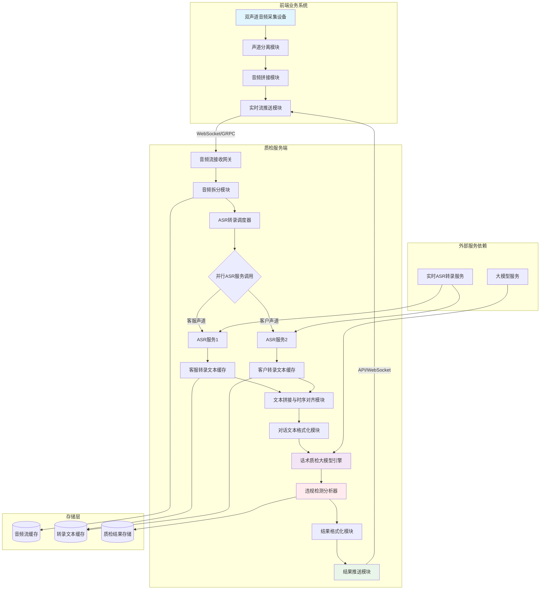
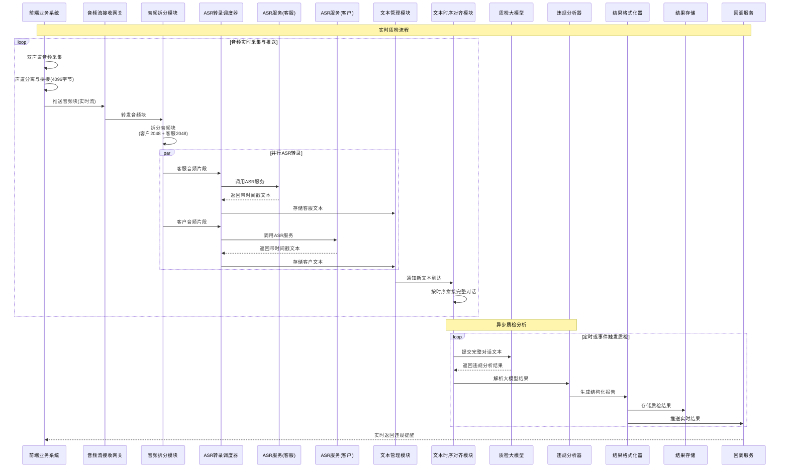

### 升级后系统整体架构图（组件图）

```mermaid
graph TB
    subgraph "前端业务系统"
        A[双声道音频采集设备] --> B[声道分离模块]
        B --> C[音频拼接模块]
        C --> D[实时流推送模块]
    end

    subgraph "质检服务端"
        E[音频流接收网关] --> F[音频拆分模块]
        F --> G[ASR转录调度器]
        G --> H{并行ASR服务调用}
        
        H -->|客服声道| I[ASR服务1]
        H -->|客户声道| J[ASR服务2]
        
        I --> K[客服转录文本缓存]
        J --> L[客户转录文本缓存]
        
        K --> M[文本拼接与时序对齐模块]
        L --> M
        
        M --> N[对话文本格式化模块]
        N --> O[话术质检大模型引擎]
        O --> P[违规检测分析器]
        P --> Q[结果格式化模块]
        Q --> R[结果推送模块]
    end

    subgraph "外部服务依赖"
        S[实时ASR转录服务] --> I
        S --> J
        T[大模型服务] --> O
    end

    subgraph "存储层"
        U[(音频流缓存)]
        V[(转录文本缓存)]
        W[(质检结果存储)]
    end

    D -->|WebSocket/GRPC| E
    F --> U
    K --> V
    L --> V
    P --> W
    R -->|API/WebSocket| D
    
    style A fill:#e1f5fe
    style O fill:#f3e5f5
    style P fill:#ffebee
    style R fill:#e8f5e8
```

### 模块交互序列图

```mermaid
sequenceDiagram
    participant FE as 前端业务系统
    participant GW as 音频流接收网关
    participant AS as 音频拆分模块
    participant Scheduler as ASR转录调度器
    participant ASR1 as ASR服务(客服)
    participant ASR2 as ASR服务(客户)
    participant TextMgr as 文本管理模块
    participant Aligner as 文本时序对齐模块
    participant Model as 质检大模型
    participant Analyzer as 违规分析器
    participant Formatter as 结果格式化器
    participant Storage as 结果存储
    participant Callback as 回调服务
    
    Note over FE,Callback: 实时质检流程
    
    loop 音频实时采集与推送
        FE->>FE: 双声道音频采集
        FE->>FE: 声道分离与拼接(4096字节)
        FE->>GW: 推送音频块(实时流)
        GW->>AS: 转发音频块
        AS->>AS: 拆分音频块<br/>(客户2048 + 客服2048)
        
        par 并行ASR转录
            AS->>Scheduler: 客服音频片段
            Scheduler->>ASR1: 调用ASR服务
            ASR1-->>Scheduler: 返回带时间戳文本
            Scheduler->>TextMgr: 存储客服文本
            
            AS->>Scheduler: 客户音频片段
            Scheduler->>ASR2: 调用ASR服务
            ASR2-->>Scheduler: 返回带时间戳文本
            Scheduler->>TextMgr: 存储客户文本
        end
        
        TextMgr->>Aligner: 通知新文本到达
        Aligner->>Aligner: 按时序拼接完整对话
    end
    
    Note over Aligner,Analyzer: 异步质检分析
    
    loop 定时或事件触发质检
        Aligner->>Model: 提交完整对话文本
        Model-->>Aligner: 返回违规分析结果
        Aligner->>Analyzer: 解析大模型结果
        Analyzer->>Formatter: 生成结构化报告
        Formatter->>Storage: 存储质检结果
        Formatter->>Callback: 推送实时结果
    end
    
    Callback-->>FE: 实时返回违规提醒
```
