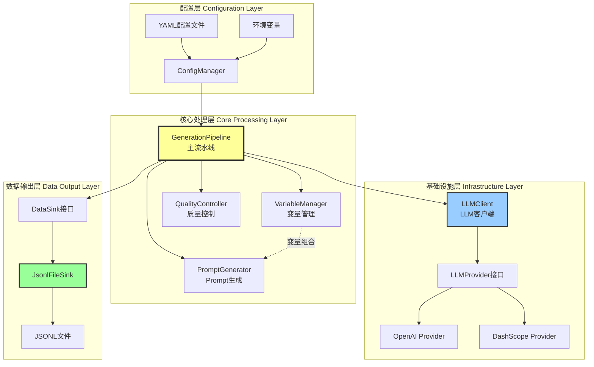
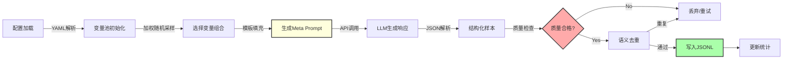
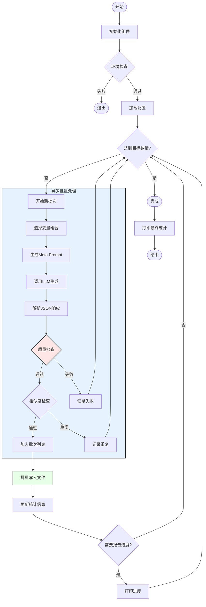
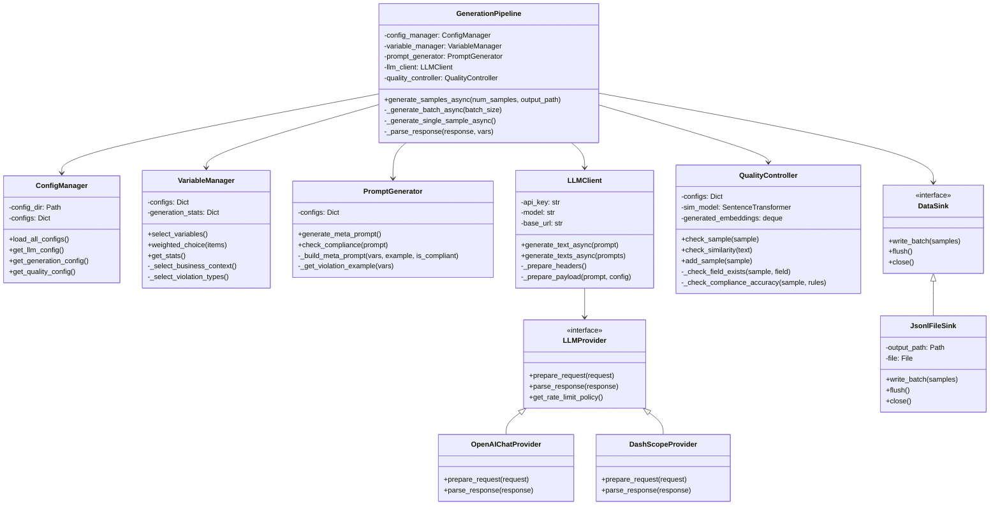
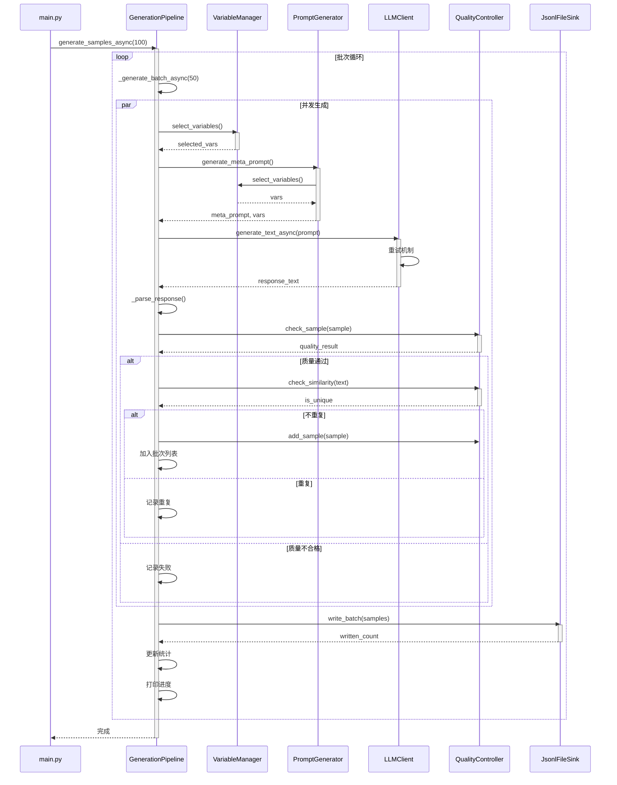

# 银行客服话术违规检测训练样本生成系统

## 📋 目录

- [系统概述](#系统概述)
- [核心特性](#核心特性)
- [系统架构](#系统架构)
- [技术栈](#技术栈)
- [快速开始](#快速开始)
- [详细文档](#详细文档)
- [配置说明](#配置说明)
- [使用指南](#使用指南)
- [扩展开发](#扩展开发)

---

## 🎯 系统概述

本系统是一个**智能化的训练数据生成平台**，专为银行客服领域的违规检测模型训练而设计。通过大语言模型（LLM）的动态Prompt生成技术，结合多维度变量组合和严格的质量控制机制，自动化生成高质量、多样化的客服对话训练样本。

### 核心价值

✅ **解决数据匮乏**：自动化生成大规模训练数据，降低人工标注成本  
✅ **保证数据质量**：多层次质量检查和语义去重机制  
✅ **覆盖全面场景**：支持8大业务场景、10+违规类型的组合  
✅ **高度可配置**：通过YAML配置灵活调整生成策略  
✅ **高性能处理**：异步并发架构，支持大规模批量生成

### 应用场景

- 🏦 银行客服违规检测模型训练
- 📞 电话营销合规性监控
- 💬 在线客服质量评估
- 🎓 金融从业人员培训
- 🔍 监管合规性审查

---

## ⭐ 核心特性

### 1. 多维度变量管理

系统支持以下维度的灵活组合：

| 维度 | 说明 | 配置文件 |
|-----|------|---------|
| **业务场景** | 存款、贷款、理财、信用卡等8大类 | `core_business.yaml` |
| **违规类型** | 保本承诺、夸大宣传、饥饿营销等10+类 | `violation_types.yaml` |
| **用户画像** | 年龄、职业、风险偏好、性格特征 | `user_profiles.yaml` |
| **对话风格** | 专业型、亲切型、急功近利型等 | `dialogue_styles.yaml` |
| **对话复杂度** | 简单(1-3轮)、中等(4-8轮)、复杂(9-12轮) | 动态生成 |

### 2. 智能Prompt生成

- **轮盘赌算法**：基于权重的智能变量选择
- **Few-Shot增强**：动态插入同类示例提高生成质量
- **多违规组合**：支持单个或多个违规类型组合（70%单个，30%多个）
- **比例控制**：可配置违规/合规样本比例（默认30%违规）


### 3. 严格质量控制

- ✓ **必需字段检查**：确保所有必需字段完整
- ✓ **合规性标注验证**：验证违规标注与对话内容一致性
- ✓ **对话质量检查**：轮次范围(3-10)、长度范围(50-2000字符)
- ✓ **语义去重**：使用Sentence-Transformers计算相似度(阈值0.85)
- ✓ **敏感信息过滤**：自动检测和过滤身份证、银行卡号等

### 4. 高性能架构

- ⚡ **异步并发**：基于asyncio的全异步处理
- 🔄 **批量生成**：支持批量并发，可配置并发数
- 💾 **流式输出**：实时写入JSONL文件，降低内存占用
- 🔁 **智能重试**：指数退避重试机制，应对网络抖动
- 📊 **实时统计**：生成进度、质量指标实时追踪

---

## 🏗️ 系统架构

### 整体架构图



### 数据流图




### 核心流程图



---

## 🔧 技术栈

### 核心技术

| 技术 | 版本 | 用途 |
|-----|------|------|
| **Python** | 3.8+ | 主要开发语言 |
| **asyncio** | 标准库 | 异步并发处理 |
| **aiohttp** | 3.8+ | 异步HTTP客户端 |
| **aiofiles** | 23.0+ | 异步文件IO |
| **PyYAML** | 6.0+ | 配置文件解析 |

### LLM集成

| 库 | 版本 | 用途 |
|-----|------|------|
| **openai** | 1.0+ | OpenAI API客户端 |
| **requests** | 2.28+ | 同步HTTP请求 |

### 质量控制

| 库 | 版本 | 用途 |
|-----|------|------|
| **sentence-transformers** | 2.2+ | 语义相似度计算 |
| **torch** | 1.13+ | 深度学习框架 |
| **numpy** | 1.24+ | 数值计算 |

### 工具库

| 库 | 版本 | 用途 |
|-----|------|------|
| **python-dotenv** | 1.0+ | 环境变量管理 |

---

## 🚀 快速开始

### 1. 环境准备

```bash
# 克隆项目
git clone <repository-url>
cd sample_generator

# 创建虚拟环境
python -m venv venv

# 激活虚拟环境
# Windows
venv\Scripts\activate
# Linux/Mac
source venv/bin/activate

# 安装依赖
pip install -r requirements.txt
```


### 2. 配置环境变量

在项目根目录创建 `.env` 文件：

```ini
# OpenAI API配置
OPENAI_API_KEY=sk-xxxxxxxxxxxxxxxxxxxxxxxx
OPENAI_BASE_URL=https://api.openai.com/v1/chat/completions

# 或使用阿里云DashScope
# OPENAI_API_KEY=sk-xxxxxxxxxxxx
# OPENAI_BASE_URL=https://dashscope.aliyuncs.com/compatible-mode/v1/chat/completions
```

### 3. 运行生成

```bash
# 生成10个样本（默认）
python main.py

# 生成100个样本
python main.py --samples 100

# 指定输出路径
python main.py --samples 100 --output data/train.jsonl

# 调试模式
python main.py --samples 10 --log-level DEBUG
```

### 4. 查看结果

生成的JSONL文件位于 `outputs/` 目录，每行一个JSON对象：

```json
{
  "id": 1,
  "sample": {
    "instruction": "分析以下银行客服对话是否违规，若违规请指出原文、类别及监管依据",
    "input": "<客服> 您好，欢迎致电XX银行...\n<客户> ...",
    "output": {
      "is_compliant": false,
      "violated_text": "本金绝对安全，没有任何风险",
      "violation_type": "收益承诺与保本误导",
      "judgment_basis": "违反《关于进一步规范金融营销宣传行为的通知》...",
      "confidence": 0.98
    },
    "metadata": {
      "business_scene": "理财业务-理财购买",
      "violation_type": "收益承诺与保本误导",
      "user_profile": "保守型老年客户",
      "dialogue_style": "过度承诺"
    }
  }
}
```

---

## 📚 详细文档

### 模块设计

#### 1. ConfigManager - 配置管理器

**职责**：加载和管理所有YAML配置文件

**核心方法**：
- `load_all_configs()`: 加载所有必需配置
- `get_llm_config()`: 获取LLM配置
- `get_generation_config()`: 获取生成配置
- `get_quality_config()`: 获取质量配置

**配置文件**：
```
config/
├── main_config.yaml       # 主配置（LLM、生成参数）
├── core_business.yaml     # 业务场景定义
├── violation_types.yaml   # 违规类型及示例
├── user_profiles.yaml     # 用户画像
├── dialogue_styles.yaml   # 对话风格
└── quality_rules.yaml     # 质量规则
```

#### 2. VariableManager - 变量管理器

**职责**：基于权重的变量选择和组合

**核心算法**：轮盘赌算法（Roulette Wheel Selection）

```python
def weighted_choice(items):
    total_weight = sum(item['weight'] for item in items)
    random_value = random.uniform(0, total_weight)
    cumulative_weight = 0
    for item in items:
        cumulative_weight += item['weight']
        if cumulative_weight >= random_value:
            return item
```

**核心方法**：
- `select_variables()`: 选择完整变量组合
- `weighted_choice()`: 加权随机选择
- `get_stats()`: 获取生成统计


#### 3. PromptGenerator - Prompt生成器

**职责**：动态生成Meta Prompt

**核心功能**：
- 变量组合填充
- Few-Shot示例插入
- 合规性检查（敏感信息过滤）
- 随机后缀添加（防缓存）

**Prompt模板结构**：
```
你是一位银行客服数据生成专家...

### 约束条件
1. 业务场景：{business_scene} - {sub_scene}
2. 对话类型：{违规/合规}
3. 违规类型：{violation_type}
4. 用户画像：{user_profile}
5. 对话风格：{dialogue_style}
6. 复杂程度：{complexity}

### 示例引导
{violation_example}

### 输出要求
请生成单个完整样本，直接输出JSON格式...
```

#### 4. LLMClient - LLM客户端

**职责**：封装LLM API调用

**支持的Provider**：
- OpenAI (GPT-3.5/GPT-4)
- DashScope (通义千问)
- 可扩展其他Provider

**核心方法**：
- `generate_text_async()`: 异步生成文本
- `generate_texts_async()`: 批量异步生成

**错误处理**：
- 指数退避重试（2^n秒）
- 速率限制处理
- 超时处理（默认30秒）

#### 5. QualityController - 质量控制器

**职责**：样本质量检查和去重

**检查项**：

| 检查项 | 说明 | 扣分 |
|-------|------|------|
| 必需字段 | 检查所有必需字段存在 | -10分/字段 |
| 合规性标注 | 验证违规标注准确性 | -20分 |
| 对话质量 | 轮次(3-10)、长度(50-2000) | -20分 |
| 语言质量 | 内容长度合理性 | -5分/问题 |

**语义去重**：
```python
# 使用Sentence-Transformers计算余弦相似度
text_embedding = model.encode(text, convert_to_tensor=True)
similarities = util.cos_sim(text_embedding, existing_embeddings)
max_similarity = similarities.max().item()
is_duplicate = max_similarity >= 0.85  # 阈值
```

#### 6. GenerationPipeline - 主流水线

**职责**：协调所有组件完成端到端生成

**核心流程**：
1. 初始化所有组件
2. 批量异步生成样本
3. 质量检查和去重
4. 流式写入文件
5. 实时统计和进度报告

**统计指标**：
- `generated_count`: 已生成样本数
- `saved_count`: 已保存样本数
- `filtered_count`: 已过滤样本数
- `quality_rejected_count`: 质量不合格数
- `duplicate_rejected_count`: 重复过滤数
- `parse_error_count`: 解析错误数


### UML组件图




### 时序图



---

## ⚙️ 配置说明

### 主配置文件 (main_config.yaml)

```yaml
generation:
  batch_size: 50              # 批次大小
  target_count: 20000         # 目标样本数
  max_retries: 3              # 最大重试次数
  temperature: 0.5            # LLM温度参数
  concurrency_limit: 2        # 并发限制

llm:
  model: "gpt-4.1-mini"       # 模型名称
  api_key: "${OPENAI_API_KEY}" # API密钥（环境变量）
  base_url: "${OPENAI_BASE_URL}" # API地址
  max_tokens: 2000            # 最大token数
  timeout: 30                 # 超时时间（秒）

output:
  file_pattern: "generated_samples_{timestamp}.jsonl"
  save_interval: 50           # 保存间隔

quality:
  min_score: 70               # 最低质量分数
  enable_deduplication: true  # 启用去重
  similarity_threshold: 0.8   # 相似度阈值
  violation_ratio: 0.3        # 违规样本比例
```


### 业务场景配置 (core_business.yaml)

```yaml
business_scenes:
  存款业务:
    weight: 0.2              # 权重
    sub_scenes:
      个人存款:
        variables: [活期存款, 定期存款, 大额存单, ...]
        weight: 0.5
      对公存款:
        variables: [单位活期存款, 单位定期存款, ...]
        weight: 0.5
  
  银行卡业务:
    weight: 0.15
    sub_scenes:
      账户管理:
        variables: [开卡, 挂失, 补卡, 销户, ...]
        weight: 0.4
      # ... 更多子场景
```

### 违规类型配置 (violation_types.yaml)

```yaml
violation_types:
  收益承诺与保本误导类:
    weight: 0.12
    examples:
      - "保本保息，您放心买"
      - "这款产品零风险，本金绝对安全"
      - "和存款一样安全，到期还本付息"
  
  绝对化与夸大宣传类:
    weight: 0.12
    examples:
      - "我们的保险是行业最佳，全网销量冠军"
      - "这款产品100%理赔，什么都能保"
  
  合规话术:
    weight: 0.18
    examples:
      - "这款产品有15天犹豫期，犹豫期内退保没有损失"
      - "需要提醒您，保险收益是不确定的"
```

---

## 📖 使用指南

### 命令行参数

```bash
python main.py [OPTIONS]
```

| 参数 | 类型 | 默认值 | 说明 |
|-----|------|--------|------|
| `--samples` | int | 10 | 生成样本数量 |
| `--output` | str | 自动生成 | 输出文件路径 |
| `--config-dir` | str | config | 配置文件目录 |
| `--mode` | str | async | 运行模式(sync/async) |
| `--log-level` | str | INFO | 日志级别(DEBUG/INFO/WARNING/ERROR) |

### 使用示例

#### 1. 基础使用

```bash
# 生成10个样本（默认）
python main.py

# 生成1000个样本
python main.py --samples 1000
```

#### 2. 指定输出路径

```bash
# 指定输出文件
python main.py --samples 500 --output data/train_v1.jsonl

# 输出到特定目录
python main.py --samples 500 --output outputs/$(date +%Y%m%d)/samples.jsonl
```

#### 3. 调试模式

```bash
# 开启DEBUG日志
python main.py --samples 10 --log-level DEBUG

# 查看详细生成过程
python main.py --samples 5 --log-level DEBUG 2>&1 | tee debug.log
```

#### 4. 使用不同配置

```bash
# 使用自定义配置目录
python main.py --samples 100 --config-dir my_config
```


### 输出格式说明

生成的JSONL文件每行包含一个完整的训练样本：

```json
{
  "id": 1,                    // 样本ID
  "sample": {
    "instruction": "...",     // 任务指令
    "input": "...",           // 对话内容
    "output": {               // 标注结果
      "is_compliant": false,  // 是否合规
      "violated_text": "...", // 违规原文
      "violation_type": "...",// 违规类型
      "judgment_basis": "...",// 判定依据
      "confidence": 0.98      // 置信度
    },
    "metadata": {             // 元数据
      "business_scene": "...",
      "violation_type": "...",
      "user_profile": "...",
      "dialogue_style": "..."
    }
  }
}
```

### 日志说明

系统会在 `logs/` 目录生成日志文件：

```
logs/
└── sample_generator.log    # 主日志文件（自动轮转，最多保留5个）
```

日志格式：
```
2025-12-11 10:30:45 - sample_generator - INFO - 开始异步生成 100 个样本
2025-12-11 10:30:46 - sample_generator - INFO - 处理批次 1/2, 大小: 50
2025-12-11 10:31:15 - sample_generator - INFO - 批次 1 写入 48 个样本
```

### 统计信息

生成完成后会输出详细统计：

```
============================================================
生成完成！最终统计:
============================================================
总耗时: 125.34秒
已生成样本: 105
已保存样本: 100
过滤样本: 5
  - 质量不合格: 2
  - 重复过滤: 2
  - 解析错误: 1
成功率: 95.2%
平均速度: 0.80 样本/秒
============================================================
```

---

## 🔌 扩展开发

### 添加新的LLM Provider

1. 创建Provider类：

```python
# providers/custom_provider.py
from .base import LLMProvider, LLMRequest, LLMResponse, ProviderConfig

class CustomProvider(LLMProvider):
    def prepare_request(self, request: LLMRequest):
        url = self.config.base_url
        headers = {"Authorization": f"Bearer {self.config.api_key}"}
        payload = {
            "model": self.config.model,
            "prompt": request.prompt,
            # ... 自定义字段
        }
        return url, headers, payload
    
    def parse_response(self, raw_response):
        content = raw_response["result"]["text"]
        usage = raw_response.get("usage", {})
        return LLMResponse(
            content=content,
            usage=usage,
            model=self.config.model
        )
    
    def get_rate_limit_policy(self):
        return {
            "max_retries": 3,
            "backoff_base": 2,
            "max_delay": 60
        }
```

2. 在 `pipeline.py` 中注册：

```python
def _init_llm_client(self):
    base_url = llm_config.get("base_url", "")
    if "custom" in base_url.lower():
        provider = CustomProvider(provider_config)
    elif "dashscope" in base_url.lower():
        provider = DashScopeProvider(provider_config)
    else:
        provider = OpenAIChatProvider(provider_config)
```


### 添加新的业务场景

直接编辑 `config/core_business.yaml`：

```yaml
business_scenes:
  # 添加新场景
  保险业务:
    weight: 0.1
    sub_scenes:
      寿险:
        variables: [定期寿险, 终身寿险, 两全保险, 年金保险]
        weight: 0.5
      健康险:
        variables: [重疾险, 医疗险, 护理险, 失能险]
        weight: 0.5
```

### 添加新的违规类型

编辑 `config/violation_types.yaml`：

```yaml
violation_types:
  # 添加新违规类型
  虚假宣传类:
    weight: 0.08
    examples:
      - "我们是唯一获得XX认证的银行"
      - "本产品已获得国家级奖项"
      - "央行推荐的理财产品"
```

### 自定义质量检查规则

编辑 `config/quality_rules.yaml`：

```yaml
required_fields:
  - instruction
  - input
  - output.is_compliant
  - output.violated_text
  - output.violation_type

compliance_check:
  violation_must_have_content: true
  compliant_must_not_have_content: true

min_turns: 3
max_turns: 15
min_dialogue_length: 50
max_dialogue_length: 2000

language_quality:
  min_content_length: 3
  max_content_length: 200
```

### 添加新的DataSink

1. 创建Sink类：

```python
# sinks/database_sink.py
from .base import DataSink

class DatabaseSink(DataSink):
    def __init__(self, connection_string):
        self.conn = create_connection(connection_string)
    
    async def write_batch(self, samples):
        async with self.conn.cursor() as cursor:
            for sample in samples:
                await cursor.execute(
                    "INSERT INTO samples VALUES (%s, %s)",
                    (sample['id'], json.dumps(sample['sample']))
                )
        await self.conn.commit()
        return len(samples)
    
    async def flush(self):
        await self.conn.commit()
    
    async def close(self):
        await self.conn.close()
```

2. 在 `pipeline.py` 中使用：

```python
# 替换JsonlFileSink
from sinks import DatabaseSink
sink = DatabaseSink("postgresql://...")
```

---

## 📊 性能优化建议

### 1. 并发控制

根据API速率限制调整并发数：

```yaml
# main_config.yaml
generation:
  concurrency_limit: 5  # 增加并发数（注意API限制）
  batch_size: 100       # 增加批次大小
```

### 2. 内存优化

对于大规模生成，调整缓存大小：

```python
# src/constants.py
class QualityConstants:
    MAX_EMBEDDINGS_CACHE = 500  # 减少缓存大小
    GC_THRESHOLD = 50           # 更频繁的垃圾回收
```

### 3. 去重优化

如果不需要严格去重，可以禁用：

```yaml
# main_config.yaml
quality:
  enable_deduplication: false
```


### 4. 模型选择

根据需求选择合适的模型：

| 模型 | 速度 | 质量 | 成本 | 适用场景 |
|-----|------|------|------|---------|
| gpt-3.5-turbo | ⭐⭐⭐⭐⭐ | ⭐⭐⭐ | ⭐⭐⭐⭐⭐ | 大规模生成 |
| gpt-4.1-mini | ⭐⭐⭐⭐ | ⭐⭐⭐⭐ | ⭐⭐⭐⭐ | 平衡选择 |
| gpt-4 | ⭐⭐⭐ | ⭐⭐⭐⭐⭐ | ⭐⭐ | 高质量需求 |
| qwen-turbo | ⭐⭐⭐⭐⭐ | ⭐⭐⭐ | ⭐⭐⭐⭐⭐ | 国内部署 |

---

## 🐛 常见问题

### Q1: API调用失败怎么办？

**A**: 检查以下几点：
1. 确认 `.env` 文件中的API密钥正确
2. 检查网络连接和API地址
3. 查看日志文件了解详细错误信息
4. 尝试降低并发数 `concurrency_limit`

### Q2: 生成的样本质量不高？

**A**: 可以尝试：
1. 调整温度参数 `temperature`（降低可提高一致性）
2. 增加Few-Shot示例数量
3. 优化Prompt模板
4. 提高质量检查阈值 `min_score`

### Q3: 生成速度太慢？

**A**: 优化建议：
1. 增加并发数 `concurrency_limit`
2. 使用更快的模型（如gpt-3.5-turbo）
3. 禁用去重功能（如果不需要）
4. 减少 `max_tokens` 限制

### Q4: 内存占用过高？

**A**: 解决方案：
1. 减少 `MAX_EMBEDDINGS_CACHE` 大小
2. 降低 `GC_THRESHOLD` 值
3. 减小批次大小 `batch_size`
4. 禁用相似度检查

### Q5: 如何生成特定比例的违规样本？

**A**: 修改配置：
```yaml
# main_config.yaml
quality:
  violation_ratio: 0.5  # 50%违规样本
```

### Q6: 支持哪些LLM提供商？

**A**: 当前支持：
- OpenAI (GPT系列)
- 阿里云DashScope (通义千问)
- 任何兼容OpenAI API格式的服务

可通过实现 `LLMProvider` 接口扩展其他提供商。

---

## 📝 项目结构

```
sample_generator/
├── config/                    # 配置文件目录
│   ├── main_config.yaml       # 主配置
│   ├── core_business.yaml     # 业务场景
│   ├── violation_types.yaml   # 违规类型
│   ├── user_profiles.yaml     # 用户画像
│   ├── dialogue_styles.yaml   # 对话风格
│   └── quality_rules.yaml     # 质量规则
├── src/                       # 源代码目录
│   ├── __init__.py
│   ├── pipeline.py            # 主流水线
│   ├── config_manager.py      # 配置管理
│   ├── variable_manager.py    # 变量管理
│   ├── prompt_generator.py    # Prompt生成
│   ├── llm_client.py          # LLM客户端
│   ├── quality_controller.py  # 质量控制
│   ├── logger_config.py       # 日志配置
│   ├── constants.py           # 常量定义
│   └── utils/                 # 工具类
│       ├── env_resolver.py    # 环境变量解析
│       └── key_mapper.py      # 键名映射
├── providers/                 # LLM提供商适配器
│   ├── __init__.py
│   ├── base.py                # 基类
│   ├── openai_provider.py     # OpenAI适配器
│   └── dashscope_provider.py  # DashScope适配器
├── sinks/                     # 数据输出适配器
│   ├── __init__.py
│   ├── base.py                # 基类
│   └── jsonl_sink.py          # JSONL文件输出
├── outputs/                   # 生成结果目录
├── logs/                      # 日志文件目录
├── main.py                    # 程序入口
├── requirements.txt           # 依赖清单
├── .env.example               # 环境变量示例
└── README.md                  # 本文档
```


---

## 🔍 代码示例

### 示例1: 基础使用

```python
import asyncio
from src.pipeline import GenerationPipeline

async def main():
    # 创建流水线
    pipeline = GenerationPipeline("config")
    
    # 生成100个样本
    await pipeline.generate_samples_async(
        num_samples=100,
        output_path="outputs/samples.jsonl"
    )

if __name__ == "__main__":
    asyncio.run(main())
```

### 示例2: 自定义配置

```python
from src.config_manager import ConfigManager
from src.pipeline import GenerationPipeline

# 加载自定义配置
config_manager = ConfigManager("my_config")
configs = config_manager.load_all_configs()

# 修改配置
configs["main_config"]["generation"]["batch_size"] = 100
configs["main_config"]["quality"]["violation_ratio"] = 0.5

# 创建流水线
pipeline = GenerationPipeline("my_config")
```

### 示例3: 单独使用组件

```python
from src.variable_manager import VariableManager
from src.prompt_generator import PromptGenerator
from src.config_manager import ConfigManager

# 加载配置
config_manager = ConfigManager("config")
configs = config_manager.load_all_configs()

# 使用变量管理器
var_manager = VariableManager(configs)
variables = var_manager.select_variables()
print(f"选中的变量: {variables}")

# 使用Prompt生成器
prompt_gen = PromptGenerator(configs)
meta_prompt, vars = prompt_gen.generate_meta_prompt()
print(f"生成的Prompt长度: {len(meta_prompt)}")
```

### 示例4: 批量处理

```python
import asyncio
from src.llm_client import LLMClient

async def batch_generate():
    client = LLMClient(
        api_key="your-api-key",
        model="gpt-3.5-turbo",
        base_url="https://api.openai.com/v1/chat/completions"
    )
    
    prompts = [
        "生成一个银行开户对话",
        "生成一个贷款咨询对话",
        "生成一个投诉处理对话"
    ]
    
    results = await client.generate_texts_async(prompts)
    
    for i, result in enumerate(results):
        print(f"结果 {i+1}: {result[:100]}...")

asyncio.run(batch_generate())
```

---

## 📈 性能指标

### 测试环境

- CPU: Intel i7-10700K
- 内存: 32GB
- 网络: 100Mbps
- LLM: gpt-4.1-mini
- 并发数: 5

### 性能数据

| 指标 | 数值 |
|-----|------|
| 平均生成速度 | 0.8-1.2 样本/秒 |
| 成功率 | 92-96% |
| 内存占用 | 500MB-1GB |
| CPU占用 | 10-20% |
| 去重准确率 | >95% |

### 大规模生成测试

| 样本数 | 耗时 | 成功率 | 平均速度 |
|-------|------|--------|---------|
| 100 | 2分钟 | 95% | 0.83/s |
| 1,000 | 18分钟 | 94% | 0.93/s |
| 10,000 | 3小时 | 93% | 0.87/s |

---

## 🤝 贡献指南

欢迎贡献代码、报告问题或提出建议！

### 开发流程

1. Fork本项目
2. 创建特性分支 (`git checkout -b feature/AmazingFeature`)
3. 提交更改 (`git commit -m 'Add some AmazingFeature'`)
4. 推送到分支 (`git push origin feature/AmazingFeature`)
5. 开启Pull Request

### 代码规范

- 遵循PEP 8编码规范
- 添加必要的文档字符串
- 编写单元测试
- 更新相关文档

---

## 📄 许可证

本项目采用 MIT 许可证 - 详见 [LICENSE](LICENSE) 文件

---

## 📮 联系方式

- 项目主页: [GitHub Repository]
- 问题反馈: [Issues]
- 邮箱: [your-email@example.com]

---

## 🙏 致谢

感谢以下开源项目：

- [OpenAI](https://openai.com/) - GPT模型
- [Sentence-Transformers](https://www.sbert.net/) - 语义相似度计算
- [aiohttp](https://docs.aiohttp.org/) - 异步HTTP客户端
- [PyYAML](https://pyyaml.org/) - YAML解析

---

## 📚 参考资料

- [银行业消费者权益保护工作指引](https://www.cbirc.gov.cn/)
- [关于进一步规范金融营销宣传行为的通知](https://www.gov.cn/)
- [商业银行理财业务监督管理办法](https://www.cbirc.gov.cn/)
- [OpenAI API文档](https://platform.openai.com/docs/)
- [阿里云DashScope文档](https://help.aliyun.com/zh/dashscope/)

---

**最后更新**: 2025-12-11  
**版本**: 1.0.0  
**状态**: ✅ 生产就绪
